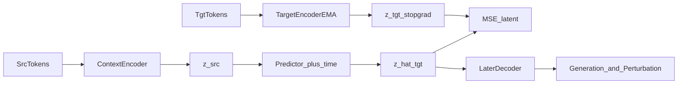

# JEPA research plan (PerturbGen replacement path)

This document is the canonical write-up for the **cell-trajectory JEPA** research track: a parallel path aimed at eventually replacing PerturbGen’s MaskGIT token-prediction backbone while recovering the same scientific applications described in the project README.

Practical tutorial: [Train Cell-Trajectory JEPA](examples/08_train_jepa.ipynb).  
Launch script: [run_train_jepa_sod2.sh](examples/run_train_jepa_sod2.sh).

---

## 1. Motivation (from PerturbGen README)

PerturbGen addresses how cells transition between states over time and how perturbations reshape those trajectories. The README states three downstream applications:

1. **Target-state expression** — predict gene expression at specified future or intermediate states.
2. **Gene programs** — aggregate learned embeddings across covariates (time, lineage, stage) for de novo programs.
3. **In silico perturbation atlases (PIPs)** — simulate interventions and cluster perturbations with similar effects.

The current stack implements this with a MaskGIT-style masking model (token CE + iterative demask/remask at generation time), then gene-embedding extraction and perturbation notebooks (examples 03–07).

**Why JEPA:** train a model that predicts **in latent embedding space** (source cell → later target cell), rather than demasking gene tokens. The long-term goal is the same three applications, with a JEPA trajectory backbone and a decoder added later for expression / KO simulation.

---

## 2. Isolation principle

Keep JEPA and MaskGIT pipelines separate while JEPA matures.

| Concern | Rule |
|--------|------|
| Outputs | Write only under `T_perturb/res/jepa` (on sod2: `/mnt/sod2-project/csb4/stuke1/perturbgen/T_perturb/res/jepa`) |
| MaskGIT dirs | Do **not** write under `T_perturb/res/masking` from JEPA jobs |
| Inputs | Shared LPS tokenized data is OK (data reuse, not model blending) |
| CLI | `train-jepa`, `train-jepa-decoder`, `eval-jepa` |
| Notebooks 04–05 | Not success criteria for Phase A; MaskGIT extract/programs stay on their own track |
| Screens / GPUs | Use a dedicated screen (e.g. `jepa_train`); avoid sharing cards with a concurrent masking extract job |

---

## 3. Architecture



- **Context encoder:** trainable; encodes source gene-token sequence → cell embedding `z_src`.
- **Target encoder:** EMA copy of the context encoder (stop-grad); encodes target timepoint → `z_tgt`.
- **Predictor:** time-conditioned MLP; maps `z_src` + target time → `z_hat`.
- **v0 unit:** cell-level mean-pooled embeddings (not gene-block JEPA yet).
- **Later:** decoder from latents → counts/tokens for generation and perturbation apps.

### Warm-start (locked for Phase A)

| Component | Init |
|-----------|------|
| `token_embedding` | Copied from LPS masking checkpoint (read-only) |
| Context / target transformer | Random (target = EMA of context) |
| Predictor | Random |
| Training objective | Latent MSE / smooth-L1 — **not** MaskGIT CE |

Warm-start does **not** load the MaskGIT demask loop, decoder FC, or count head. JEPA remains a separate model with a separate loss.

### Code map

| Piece | Path |
|-------|------|
| Model | [`perturbgen/Modules/jepa.py`](../perturbgen/Modules/jepa.py) |
| Trainer (Phase A / D) | [`perturbgen/Model/jepa_trainer.py`](../perturbgen/Model/jepa_trainer.py) |
| Eval (Phases B–F helpers) | [`perturbgen/jepa_eval.py`](../perturbgen/jepa_eval.py) |
| Metrics | [`perturbgen/src/jepa_metrics.py`](../perturbgen/src/jepa_metrics.py) |
| Train CLI wiring | [`perturbgen/train.py`](../perturbgen/train.py) (`--train_mode jepa` / `jepa_decoder`) |

---

## 4. Phased research trajectory (A–F)

### Phase A — Trainability (gate)

**Question:** Can JEPA train stably on LPS src→tgt pairs?

- Build: `CellTrajectoryJEPA` + `JEPATrainer`; CLI `--train_mode jepa`.
- Recipe: warm-start token emb; EMA τ ≈ 0.996; no token CE; no generation loop.
- **Pass:** train/val loss finite and decreasing; `collapse_std_mean` stays non-zero; no NaNs; optional UMAP structure by time/cell type.
- **Fail →** tune LR / EMA / capacity inside JEPA only.

### Phase B — Representation quality

**Question:** Are JEPA latents biologically useful vs MaskGIT embeddings?

- Compare cell embeddings (same LPS split): linear probes, silhouette, neighbor purity.
- **Pass:** match or beat MaskGIT on ≥2 metrics; clear structure by time/cell type.
- Run as a dedicated comparison job; do not mix result folders.

### Phase C — Trajectory prediction

**Question:** Can we predict future cell state in latent space better than baselines?

- Multi-horizon src→t1/t2/t3; baselines: identity (`z_src`), mean, MaskGIT+MLP.
- **Pass:** beat identity (and strong baselines) on held-out pairs; ablations explain the signal.

### Phase D — Recover generation

**Question:** Can latents become expression again?

- Attach count / expression head (`train-jepa-decoder`); freeze JEPA first, then light joint fine-tune.
- Evaluate with distribution metrics (e.g. MSE / MMD / EMD), not MaskGIT remask loops first.
- **Pass:** competitive fidelity vs MaskGIT on LPS target states before claiming replacement.

### Phase E — Programs + perturbation (README apps)

**Question:** Does JEPA support the three PerturbGen applications?

- Gene programs from JEPA embeddings; latent intervention → predict `z_tgt` → decode; PIP-style atlas.
- **Pass:** end-to-end programs + perturbation atlas on JEPA; document wins/losses vs MaskGIT.

### Phase F — Scale and replacement package

- Multi-dataset / pretraining-cohort JEPA only after LPS replacement bar holds.
- Package: representation + trajectory + generation + perturbation comparison.

---

## 5. Current job: Phase A (warm-start)

### Data (shared inputs)

Root: `T_perturb/tokenized_data/LPS_all_tps_2k/`

- Source: `dataset_2000_hvg_src/normal.dataset`, `h5ad_pairing_2000_hvg_src/normal.h5ad`
- Targets: `dataset_2000_hvg_tgt/{1_90m,2_6h,3_10h}_LPS.dataset` (+ matching h5ads)
- Mappings: `token_id_to_genename_2000_hvg.pkl`, `tokenid_to_rowid_2000_hvg.pkl`

### Warm-start checkpoint (read-only)

```text
T_perturb/res/masking/checkpoints/20260729_1751_cellgen_train_masking_lr_0.0001_wd_0.0001_batch_64_ptime_pos_sin_m_pow_tp_1-2-3_s_0-epoch=19.ckpt
```

### Launch

```bash
screen -S jepa_train
bash docs/examples/run_train_jepa_sod2.sh
# Ctrl+A then D to detach
```

Or follow [08_train_jepa.ipynb](examples/08_train_jepa.ipynb).

**Recommended settings**

- `CUDA_VISIBLE_DEVICES=5,6,7`
- `--split True --splitting_mode stratified --split_obs cell_type_harmonized` (so `val/jepa_loss` is meaningful)
- `--ckpt_masking_path` set (warm-start)
- `--output_dir` → sod2 `.../T_perturb/res/jepa`
- `WANDB_MODE=offline`

**Metrics to watch**

- `train/jepa_loss`, `val/jepa_loss`
- `collapse_std_mean`, `collapse_mean_cosine`
- `latent_cosine`
- `val/baseline_identity_mse` vs `val/baseline_jepa_mse`

### After Phase A passes

1. Dump JEPA cell embeddings under `.../res/jepa/embeddings/`.
2. Run trajectory eval (JEPA-only):

```bash
python -m perturbgen eval-jepa --phase c \
  --jepa_embeddings /mnt/sod2-project/csb4/stuke1/perturbgen/T_perturb/res/jepa/embeddings/jepa_cell_embeddings.pt \
  --output_dir /mnt/sod2-project/csb4/stuke1/perturbgen/T_perturb/res/jepa/eval
```

Full MaskGIT vs JEPA representation comparison is Phase B (separate job).

---

## 6. Non-goals and FAQ

**Is this scratch training?**  
No. Phase A is locked to **warm-start** token embeddings from the masking ckpt. Scratch is a later ablation if needed.

**Is demask/remask part of JEPA?**  
No. Demask/remask is MaskGIT **inference** (iterative generation). JEPA training is one forward pass + latent MSE.

**When do we compare to MaskGIT embeddings?**  
Phase B, as an explicit comparison job—not during Phase A trainability.

**When can we claim PerturbGen replacement?**  
Not before Phase D (generation fidelity) and preferably Phase E (programs + PIPs).

**Can we reuse notebooks 04–05 for JEPA Phase A?**  
No. Those are MaskGIT gene-embedding / program workflows. JEPA has its own output dir and `eval-jepa` tooling.

---

## 7. CLI quick reference

```shell
# Phase A train
python -m perturbgen train-jepa --train_mode jepa ...

# Phase D decoder
python -m perturbgen train-jepa-decoder --train_mode jepa_decoder ...

# Phases B–F helpers
python -m perturbgen eval-jepa --phase all \
  --jepa_embeddings path/to/jepa_cell_embeddings.pt \
  --output_dir path/to/jepa/eval
```
