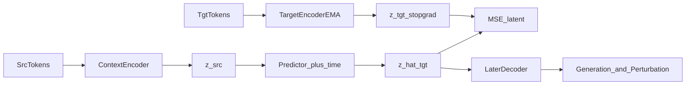

# JEPA Research Trajectory (PerturbGen Replacement)

## Goal
Replace PerturbGen’s MaskGIT token-prediction backbone with a **JEPA trajectory backbone**, while eventually recovering the same applications: target-state prediction, gene programs, and in silico perturbation atlases.

**Principle:** parallel thin path first; do not rewrite MaskGIT demask/remask until representations work. Reuse data, Lightning harness, and pretrained encoder weights.

## Architecture target

- **Context encoder:** init from current masking ckpt in [`Perturbgen/perturbgen/Modules/transformer.py`](Perturbgen/perturbgen/Modules/transformer.py) (`PerturbGen` / mean-pool via `mean_nonpadding_embs`).
- **Target encoder:** EMA copy of context encoder (stop-grad).
- **Predictor:** small MLP/Transformer conditioned on target time.
- **v0 unit:** cell-level embedding (`mean_embedding`), not gene tokens.
- **Later:** decoder from latents back to tokens/counts for generation + KO simulation.

## What we reuse vs ignore early

**Reuse**
- Paired LPS data + [`Perturbgen/perturbgen/Dataloaders/datamodule.py`](Perturbgen/perturbgen/Dataloaders/datamodule.py)
- Train shell in [`Perturbgen/perturbgen/train.py`](Perturbgen/perturbgen/train.py) (add `train_mode=jepa`)
- Lightning patterns from [`Perturbgen/perturbgen/Model/trainer.py`](Perturbgen/perturbgen/Model/trainer.py)
- Pretrained masking encoder under `Perturbgen/pretraining_cohort/` or LPS fine-tuned ckpt

**Ignore until Phase D**
- MaskGIT iterative demask/remask (`generate_sequence` in scmaskgit / PerturbGen)
- Count decoder training
- Gene embedding extraction notebooks 04–05 as success criteria for Phase A

---

## Phase A — Trainability (gate: must pass)

**Question:** Can JEPA train stably on LPS src→tgt pairs?

**Build**
- `CellTrajectoryJEPA` module: context encoder, EMA target encoder, time-conditioned predictor
- `JEPATrainer` Lightning module: latent MSE/smooth-L1 only
- CLI: `--train_mode jepa`, same LPS paths / GPUs `5,6,7`, sod2 outputs

**Train recipe**
- Init context encoder from masking ckpt; predictor random; EMA τ ≈ 0.996–0.999
- Predict one target time per step (or average over `pred_tps`)
- No token CE, no generation loop

**Pass criteria**
- Train loss decreases; val loss tracks without NaNs
- Embedding variance stays non-collapsed (monitor `std(z)`, mean cosine sim)
- Sanity plot: UMAP of `z` separates time and/or cell type at least weakly

**Fail → debug before advancing:** LR, EMA rate, freeze-vs-finetune encoder, predictor capacity.

---

## Phase B — Representation quality

**Question:** Are JEPA latents biologically useful vs MaskGIT embeddings?

**Work**
- Extract cell embeddings from JEPA context/target encoders
- Compare to current masking-model embeddings (same LPS split)
- Metrics: time/cell-type linear probes, silhouette, neighbor purity
- Optional gene-level readout: attention-pool or token embeddings from encoder (still no generation)

**Pass criteria**
- JEPA match or beat masking baseline on at least 2 representation metrics
- Clear qualitative structure by time / cell type

---

## Phase C — Trajectory prediction as the scientific core

**Question:** Can we predict future cell state in latent space better than baselines?

**Work**
- Multi-horizon: src → t1, t2, t3; held-out time extrapolation if data allows
- Baselines: identity (`z_src`), linear probe, frozen MaskGIT mean-embed + MLP
- Metrics: latent MSE/cosine; optional decode-later proxy once a tiny decoder exists
- Ablations: EMA on/off, time conditioning, init-from-ckpt vs scratch

**Pass criteria**
- Beats identity + MaskGIT+MLP on held-out pairs
- Ablations explain what carries the signal

---

## Phase D — Recover generation (required for replacement)

**Question:** Can latents become expression again?

**Work**
- Attach decoder on frozen or lightly tuned JEPA backbone:
  - first: count / expression head (simpler than full MaskGIT)
  - then: token head if needed for gene-rank compatibility with existing pipelines
- Train decoder with JEPA encoder mostly frozen, then joint fine-tune lightly
- Evaluate with existing distribution metrics in [`Perturbgen/perturbgen/src/metric.py`](Perturbgen/perturbgen/src/metric.py) (MMD/EMD), not remask loops first

**Pass criteria**
- Competitive generation fidelity vs current MaskGIT on LPS target states
- Only then consider MaskGIT-style iterative sampling if token generation is still needed

---

## Phase E — Perturbation + programs (full PerturbGen apps)

**Question:** Does the JEPA stack support the three PerturbGen applications?

**Work**
- Gene programs from JEPA gene/cell embeddings (reuse analysis ideas from notebooks 05)
- In silico perturbation: intervene in latent or token space, predict downstream `z_tgt`, decode
- Perturbation atlas / PIP-style clustering
- Scale beyond LPS only after LPS replacement bar is met

**Pass criteria**
- Recover program discovery + perturbation atlas workflows end-to-end on JEPA
- Document where JEPA wins/loses vs MaskGIT PerturbGen

---

## Phase F — Scale and claim replacement

- Pretraining-cohort or multi-dataset JEPA pretrain (if LPS replacement holds)
- Stronger architecture only if Phase A–C saturate (deeper predictor, gene-block JEPA as add-on)
- Final comparison package: representation + trajectory + generation + perturbation

---

## Near-term execution order (next concrete work)

1. Design & implement Phase A module + trainer + `train_mode=jepa`
2. One LPS trainability run (init from masking ckpt)
3. Collapse/NaN diagnostics + UMAP sanity
4. Freeze Phase A recipe; only then start Phase B embedding comparisons

## Explicit non-goals for now
- Rewriting demask/remask inference
- Gene-block JEPA as the first experiment
- Full pretraining-cohort JEPA before LPS trainability passes
- Claiming replacement before Phase D generation bar
